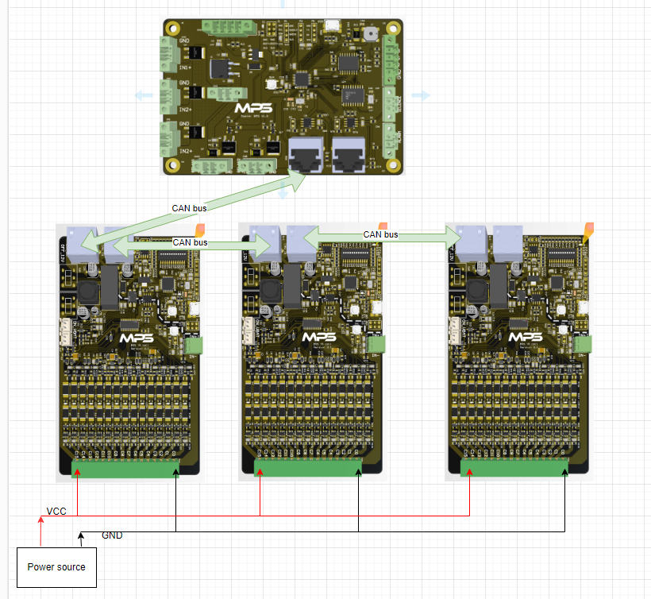

# STM32 BMS
This project is BSM monitor battery voltage and percent, temperature, SOC ... has 3 tools
- "battery_CAN_Show_v2": BMS master monitor battery voltage
- "battery_monitor_v3": client battery monitor
- "QT_Gui_Battery_Show": tools show battery and simulation battery client
# Build this project
build project by stm32 cubeide and IAR, QT5
# Hardware

# UI link for nextion LCD
https://www.figma.com/file/KZnPZJvIBvqHUTcTi8bEAP/Battery-Management?type=design&node-id=19-2225&mode=design&t=xZmktoam9JMLjmON-0
# Nextion LCD
- Hardware use NX8048P050
- Ui project for nextion LCD see "Ui_nextion" folder

## Run this project
- battery_CAN_Show_v2: 
- battery_monitor_v3: Note if want to goes to simulation mode need to change all dip sw to 0 position
## Block diagram of project

# Picture of battery monitor software

## need to test
- Update firmware via CAN bus
- Update ui of master monitor battery voltage via Serial interface
- Test actual control action